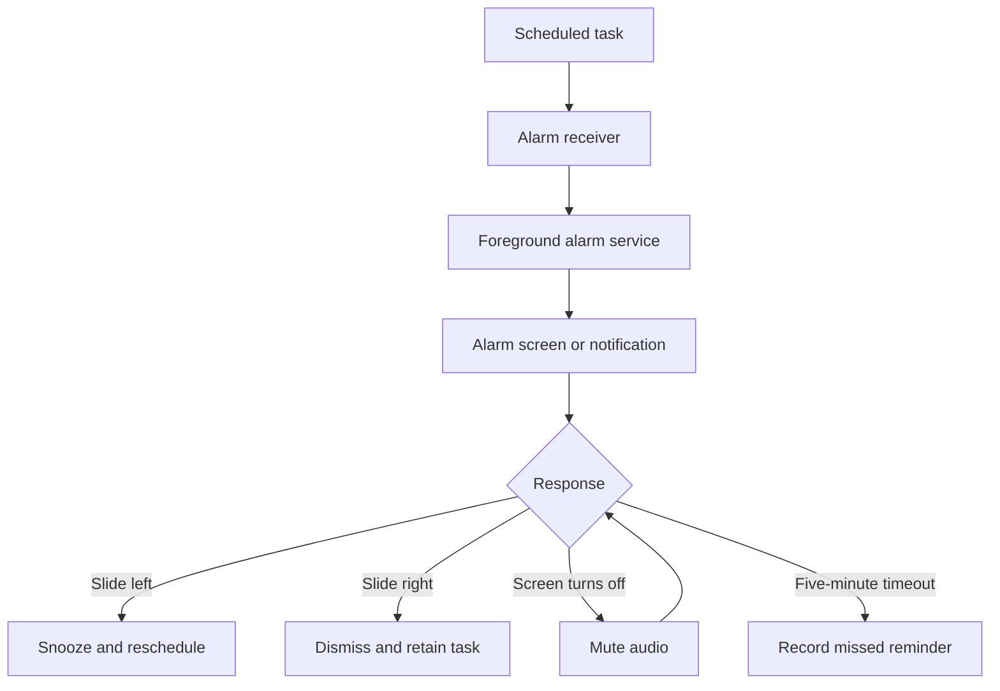

# Dev Reminder

**An offline Android task reminder app with a Flutter interface and native Kotlin alarm handling.**

Dev Reminder helps users plan tasks, choose reminder times, and respond to alarms through snooze and dismiss actions. It combines a daily task list and calendar with an alarm screen designed to show the reminder time and task clearly, including when the phone is locked or sleeping.

The app does not require an account, a backend, or an internet connection for normal use. Task records and settings are stored on the device.

> **Project status:** This README describes the source with both the reminder-feature patch and the subsequent Gradle build patch applied. The corrected APK build and native alarm behavior have not yet been verified on a device. Features below describe the implementation, not a guarantee of tested behavior on every Android phone.

## Contents

- [Features](#features)
- [How it works](#how-it-works)
- [Screens and controls](#screens-and-controls)
- [Tech stack](#tech-stack)
- [Project structure](#project-structure)
- [Data and task states](#data-and-task-states)
- [Setup and local build](#setup-and-local-build)
- [GitHub Actions](#github-actions)
- [Permissions and device behavior](#permissions-and-device-behavior)
- [Testing](#testing)
- [Troubleshooting](#troubleshooting)
- [Scope and future improvements](#scope-and-future-improvements)

## Features

| Feature | Implementation |
| --- | --- |
| Daily task list | Shows today's tasks in time order. |
| Task management | Add, edit, delete, and mark tasks complete. |
| Calendar | Select a date, view its tasks, and create future tasks. |
| Optional reminders | Enable or disable reminders for individual tasks. |
| Time validation | Reject reminder times that have already passed. |
| Native Android scheduling | Uses `AlarmManager.setAlarmClock()` through a Flutter method channel. |
| Lock-screen alarm | Dedicated native activity with time, date, greeting, task title, and a navy background. |
| Gesture controls | Slide the central alarm control left to snooze or right to dismiss. |
| Alternative controls | Snooze and dismiss buttons complement the slider. |
| Looping audio | Native media playback uses the phone's alarm volume and the bundled sound when available. |
| Power-button mute | A screen-off event silences the active alarm without dismissing the task. |
| Snooze preferences | Default choices: 5, 10, 15, 30, or 60 minutes; the value is copied into newly created tasks. |
| Sound preference | Enable or disable alarm sound in Settings. |
| Missed reminders | An active unanswered alarm times out after five minutes and records a missed event. |
| Multiple alarms | Reminders that arrive while another alarm is active are queued in the native service. |
| Recovery | Restores future schedules on supported restart, package-update, permission, and time-change events. |
| Offline storage | SQLite stores tasks; preferences store settings, native schedules, and pending action events. |

## How it works

### 1. Create and schedule a task

The user chooses a date, enters a title, selects a time, and enables or disables the reminder. For a reminder-enabled task, the Flutter service sends the task ID, notification ID, title, timestamp, and snooze duration to Android through the `dev_reminder/alarms` method channel.

Android registers the alarm and persists its scheduling data. The Flutter task-saving flow schedules the alarm before saving the task record, so a scheduling rejection can be shown to the user instead of silently claiming success.

### 2. Trigger the alarm

At the scheduled time, `AlarmReceiver` receives the alarm event and starts `AlarmService`. The service creates a foreground alarm notification, requests a full-screen presentation, and starts audio if sound is enabled and audio focus is granted.

`AlarmActivity` presents the native alarm interface. This path does not depend on opening a Flutter route from a cold start. Android still controls whether the screen opens automatically or a notification appears instead.

### 3. Handle the response



Snoozing schedules a new alarm relative to the current time. Dismissing stops the alarm and preserves the task; it does not mark the task completed. Muting stops audio while leaving snooze and dismiss available.

### 4. Synchronize task status

Native actions are stored as events until Flutter processes them. During refresh or app resume, the Flutter service updates SQLite and acknowledges each event only after the database update finishes. Snoozed events also update the task's displayed date and time.

Future native schedules can be restored after a reboot and unlock. Overdue schedules encountered during restoration are marked missed rather than replayed as fresh alarms.

## Screens and controls

| Screen | Purpose |
| --- | --- |
| Home | Today's task list, completion controls, add-task button, calendar, and settings access. |
| Add/Edit Task | Task title, time selection, reminder toggle, and validation messages. |
| Calendar | Date navigation, task markers, and task management for the selected day. |
| Settings | Default snooze duration, sound preference, and Android permission shortcuts. |
| Native Alarm | Greeting, scheduled time, date, task title, circular slider, snooze/dismiss buttons, and mute status. |

The native Android screen uses a deep navy background, a softer circular field, a white draggable alarm control, and a large clock inspired by the supplied design reference. A Flutter alarm screen remains in the source for the existing notification-routing path; Android's new scheduling flow uses the Kotlin activity.

## Tech stack

### Application technologies

| Technology | Role |
| --- | --- |
| Flutter / Dart | Main interface, task forms, calendar, application state, and platform communication. |
| Kotlin | Android alarm scheduling, receivers, service, native screen, and audio handling. |
| SQLite with `sqflite` | Persistent local task database. |
| `shared_preferences` | Flutter settings and migration marker. |
| Android `SharedPreferences` | Native alarm records, sound setting, and pending action events. |
| `AlarmManager` | Native alarm-clock scheduling. |
| Foreground service / notifications | Active alarm lifecycle and notification actions. |
| `MediaPlayer` / `AudioManager` | Looping sound, alarm audio attributes, and audio focus. |
| GitHub Actions | Analysis, tests, APK build, artifact upload, and tagged-release publishing. |

### Declared package constraints

These are the constraints in `pubspec.yaml`, not a claim about the exact versions resolved by a lockfile.

| Package | Constraint | Purpose |
| --- | --- | --- |
| `sqflite` | `^2.3.3` | SQLite access. |
| `path` | `^1.9.0` | Database paths. |
| `flutter_local_notifications` | `^17.2.2` | Notification initialization, permission requests, and legacy/fallback notification handling. |
| `timezone` | `^0.9.4` | Time-zone-aware fallback scheduling. |
| `flutter_timezone` | `^1.0.8` | Device time-zone lookup. |
| `table_calendar` | `^3.1.2` | Calendar interface. |
| `intl` | `^0.19.0` | Date and time formatting. |
| `shared_preferences` | `^2.2.3` | User preferences. |
| `uuid` | `^4.4.0` | Task identifiers. |
| `cupertino_icons` | `^1.0.6` | Icon assets. |
| `flutter_launcher_icons` | `^0.13.1` | Development-time launcher icon generation. |
| `flutter_lints` | `^3.0.0` | Static analysis rules. |
| `flutter_test` | Flutter SDK | Unit and widget tests. |

### Build configuration in the supplied patch

| Component | Configured value |
| --- | --- |
| Flutter in CI | `3.24.0` |
| Dart constraint | `>=3.0.0 <4.0.0` |
| Java runtime in CI | Temurin JDK `17` |
| Java / Kotlin bytecode target | `11` |
| Android Gradle plugin | `7.4.2` |
| Gradle wrapper | `7.6.4` |
| Kotlin Gradle plugin | `1.9.22` |
| Core library desugaring | `2.0.4` |
| Android minimum SDK | `23` |
| Android compile / target SDK | `34` / `34` |
| Application ID | `com.example.dev_reminder` |
| App version | `1.0.0+1` |

These values document the supplied build correction. A successful CI build is still required to confirm the combined configuration.

## Project structure

| Path | Responsibility |
| --- | --- |
| `lib/main.dart` | App startup, theme, and Flutter notification navigation. |
| `lib/models/task.dart` | Task model and serialization. |
| `lib/db/database_helper.dart` | SQLite creation and task operations. |
| `lib/screens/` | Home, calendar, settings, and Flutter alarm screens. |
| `lib/widgets/` | Task editor, task tile, and empty-state components. |
| `lib/services/notification_service.dart` | Native bridge, scheduling, migration, and event synchronization. |
| `lib/constants/` | App colors. |
| `lib/utils/` | Date and time helpers. |
| `android/app/src/main/kotlin/com/example/dev_reminder/MainActivity.kt` | Method-channel host and permission settings links. |
| `android/app/src/main/kotlin/com/example/dev_reminder/AlarmStore.kt` | Native persistence, scheduling, restoration, and alarm receiver. |
| `android/app/src/main/kotlin/com/example/dev_reminder/AlarmService.kt` | Audio, alarm queue, notification, mute handling, and timeout. |
| `android/app/src/main/kotlin/com/example/dev_reminder/AlarmActivity.kt` | Lock-screen UI and slider. |
| `android/app/src/main/AndroidManifest.xml` | Components and permissions. |
| `android/app/build.gradle` | Android application build configuration. |
| `android/settings.gradle` | Plugin versions and Flutter Gradle integration. |
| `android/gradle/wrapper/gradle-wrapper.properties` | Gradle distribution version. |
| `assets/` | Launcher artwork and alarm sound. |
| `test/` | Widget and notification-bridge tests. |
| `.github/workflows/build-apk.yml` | CI and release workflow. |

## Data and task states

The database is `dev_reminder.db`, with a `tasks` table.

| Field | Meaning |
| --- | --- |
| `id` | Unique task ID. |
| `title` | Task description. |
| `date` / `time` | Local date (`YYYY-MM-DD`) and time (`HH:mm`). |
| `status` | Task/reminder state. |
| `reminderEnabled` | Whether the task has an alarm. |
| `snoozeDuration` | Task-specific snooze interval in minutes. |
| `notificationId` | Integer used to identify the scheduled alarm. |
| `createdAt` / `updatedAt` | Record timestamps. |

User-visible task states include `scheduled`, `snoozed`, `completed`, `dismissed`, and `missed`. Native alarm records separately use `scheduled` and `ringing`. Deleting a task removes its database record and cancels its alarm.

No account system, cloud synchronization, or export/import feature is implemented. Local storage does not imply database encryption or a custom backup system.

## Setup and local build

### Prerequisites

- Flutter `3.24.0` and its bundled Dart SDK.
- JDK `17` for the build environment.
- Android SDK, including platform `34`, accepted SDK licenses, and an Android device or emulator.
- The project with both previously supplied code patches applied.

Normal app use is offline. Initial development setup and dependency downloads require internet access.

### Prepare the project

Run from the folder containing `pubspec.yaml`:

```bash
flutter doctor
flutter create . --org com.example --project-name dev_reminder --platforms=android --android-language kotlin --no-pub
flutter pub get
```

The uploaded source relies on generating missing Android scaffolding. Retain the patched Kotlin files, manifest, Gradle files, and workflow; do not replace them with default templates or use `--overwrite`.

Copy the alarm asset into Android resources. This cross-platform command requires Python:

```bash
python -c "from pathlib import Path; import shutil; p=Path('android/app/src/main/res/raw'); p.mkdir(parents=True, exist_ok=True); shutil.copyfile('assets/alarm.mp3', p/'alarm.mp3')"
```

If that resource is absent, the native service attempts to use the system alarm sound.

### Analyze, test, and build

```bash
flutter clean
flutter pub get
dart run flutter_launcher_icons
flutter analyze
flutter test
flutter build apk --release
```

Expected build output after success:

```text
build/app/outputs/flutter-apk/app-release.apk
```

For development on a connected device:

```bash
flutter run
```

The supplied release configuration currently uses debug signing for development distribution. Configure a maintained release signing key before production distribution. Android lock-screen alarm behavior requires device validation even after compilation succeeds.

## GitHub Actions

The workflow runs on pushes to `main` or `master`, tags matching `v*`, and manual dispatch.

1. Install Flutter, resolve dependencies, run analysis, and run tests.
2. Generate missing Android scaffolding and verify native files.
3. Copy the alarm resource and verify pinned build-tool versions.
4. Clean, resolve dependencies, generate icons, and build the release APK.
5. Rename the output to `dev_reminder.apk` and upload the `dev-reminder-app-release` artifact.
6. For a matching version tag, create a GitHub release containing the APK.

For a manual run, open the repository's **Actions** tab, choose **Build Dev Reminder APK**, and select **Run workflow**. Download the artifact after the build succeeds. This README does not assert that a published APK release currently exists.

## Permissions and device behavior

Settings provides separate controls for notification access, exact alarms, full-screen access, and the alarm notification channel.

| Permission or setting | Purpose |
| --- | --- |
| `POST_NOTIFICATIONS` | Visible notifications where runtime permission is required. |
| `SCHEDULE_EXACT_ALARM` | Exact alarm scheduling. |
| `USE_FULL_SCREEN_INTENT` | Alarm notification's full-screen presentation. |
| `FOREGROUND_SERVICE` / `FOREGROUND_SERVICE_MEDIA_PLAYBACK` | Active native alarm service. |
| `WAKE_LOCK` | Bounded CPU wake lock while handling an active alarm. |
| `RECEIVE_BOOT_COMPLETED` | Restore future alarms after boot and unlock. |
| High-priority alarm channel | Supports prominent alarm notifications. |

The manifest also retains `VIBRATE`; the new native service does not implement a separate vibration pattern.

Important behavior boundaries:

- **Screen off is different from powered off.** The implementation targets a sleeping or locked phone; it cannot execute while the phone is fully powered off.
- **Power-button mute uses `ACTION_SCREEN_OFF`.** It reacts when the power button turns the screen off, and also when the system turns the screen off. It does not intercept every physical power-key press.
- **Android controls presentation.** An unlocked device may show a heads-up notification instead of launching the full-screen activity.
- **Force-stop interrupts delivery.** Reopen the app to restore eligible future schedules. Swiping the app from recent apps is a different action, but manufacturer restrictions can still affect background behavior.
- **Volume and audio policy matter.** The service uses alarm audio attributes and requests audio focus; it does not override all device sound restrictions.
- **Recovery is not replay.** Overdue alarms found during restoration are recorded as missed.
- **Android is the implemented native target.** The presence of Flutter and fallback notification code does not establish equivalent iOS support.

## Testing

`test/widget_test.dart` covers the empty-state message and task title/time rendering.

`test/notification_service_test.dart` covers the Android method-channel contract for future scheduling, disabled reminders, completed tasks, past-time rejection, relative snoozing, and permission-error propagation. These tests mock the native channel; they do not execute Android's alarm service.

The supplied configuration has had file-structure and workflow checks, but the corrected APK build, test suite execution, and device behavior remain unverified in the preparation environment.

Before treating a release as validated, check:

- A reminder while the app is open, backgrounded, and the screen is locked.
- Power-button mute without dismissing the reminder.
- Slider cancellation, snooze, dismiss, and notification actions.
- The five-minute timeout and subsequent missed status.
- Multiple reminders due together.
- Reboot recovery, denied permissions, and edited/cancelled tasks.
- Task status refresh after native alarm actions.

## Troubleshooting

| Symptom | Check |
| --- | --- |
| `lintVitalAnalyzeRelease` / `D8BackportedMethodsGenerator` failure | Confirm all four build-patch files are applied. The patch pins AGP `7.4.2`, Gradle `7.6.4`, Kotlin `1.9.22`, and matching Java/Kotlin target `11`, with desugaring `2.0.4`. Run a clean build and retain the full log if it still fails. |
| Saving a reminder fails | Check exact-alarm access and select a future date/time. |
| No full-screen screen | Check notification permission, full-screen access, channel priority, and whether Android is showing a banner instead. |
| Alarm is silent | Check the app's sound toggle, phone alarm volume, screen-off mute state, and device audio restrictions. |
| Task appears unchanged after an alarm action | Resume or refresh the task list so native events are synchronized. |
| Alarm does not fire after shutdown or force-stop | Power the device on and reopen the app; overdue reminders are not replayed automatically. |
| Custom alarm sound is missing | Confirm `assets/alarm.mp3` was copied to `android/app/src/main/res/raw/alarm.mp3`. |

## Scope and future improvements

The current project implements one-time task reminders. The following are possible future additions, **not existing features**:

- Daily/weekly recurring schedules.
- Per-task sound selection and configurable vibration.
- Backup, export, and import.
- Search, categories, and task priorities.
- A dedicated missed-reminder history view.
- Native instrumentation tests and broader device coverage.
- Production signing and release-management improvements.
- A separately designed and tested iOS implementation.

## License

No license file was included in the supplied source archive. Add an explicit license before presenting the project as open source or defining redistribution terms.
